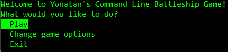
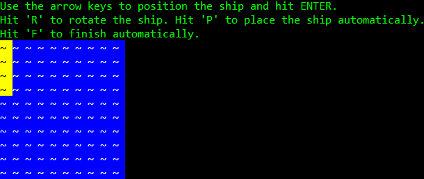
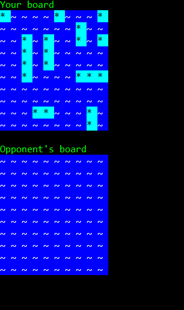

# Command Line Battleship Game

A command line Battleship game.

The game uses [YonatanMankovich.BattleshipGameEngine](https://github.com/yonimn2000/battleship-game-engine) as its engine.

This is a complete makeover of my first version of the game which can be found [here](https://github.com/yonimn2000/command-line-battleship).

## Game Options XML

```xml
<BoardOptions>
  <AllowAdjacentShips>false</AllowAdjacentShips>
  <AllowExtraMoveAfterHit>true</AllowExtraMoveAfterHit>
  <BoardSize width="10" height="10"/>
  <Ships>
    <Ship count="1" height="4" width="1" name="Battleship"/>
    <Ship count="2" height="3" width="1" name="Cruiser"/>
    <Ship count="3" height="2" width="1" name="Destroyer"/>
    <Ship count="4" height="1" width="1" name="Submarine"/>
  </Ships>
</BoardOptions>
```

Note that this file opens from the main menu of the game.

## Gameplay

### Main Menu



### Placing Ships on Board



### The Match


